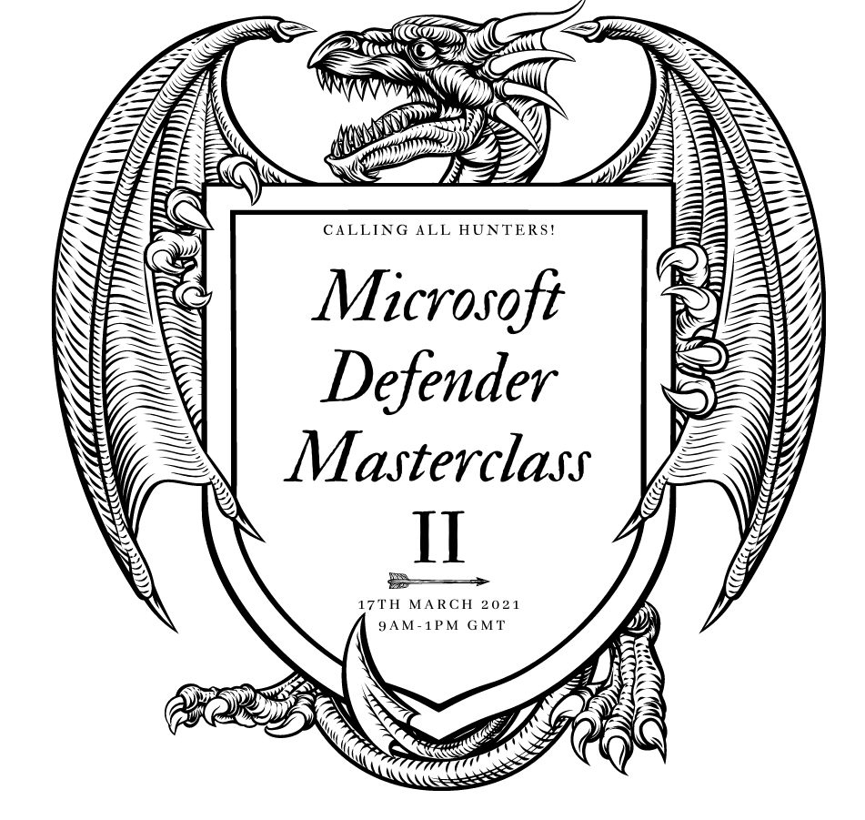

Welcome to the Defender Masterclass repository. 

Registration page - https://aka.ms/defendermasterclass-reg

Feedback form - https://aks.ms/defendermasterclass-feedback

Masterclass II - 17th March 2021

Agenda:

9am - Introducation and Updates - James Graham (host)

9:10am - Opening Keynote - Becky Cholerton

9:30am - Advanced Threat Hunting - Christos Ventouris

10:30am - Break 1

10:40am - Live Response - Steve Newby

11:40am - Break 2

11:50am - Teams Multitenant Power Virtual Agent Integration Lab - Jack Lewis/James Graham

12:55pm - Close - James Graham

Prerequisites - please complete Defender Masterclass - Labs Getting Started.pdf 

----------------------------------------------------------------------------------------------------

Masterclass I - 13th January 2021

Slides for Masterclass I now uploaded.

Recordings: https://aka.ms/defendermasterclass-recordings

Masterclass I - Attack Scenario 1 https://youtu.be/ufRkI4Zdx7k

Masterclass I - Attack Scenario 2 https://youtu.be/BVIiuGMwlZ0

Masterclass I - Power Platform Lab https://youtu.be/Yk01aOnHs4I

Link to this repo - https://aka.ms/defendermasterclass-repo

Registration page - https://aka.ms/defendermasterclass-reg

Feedback form - https://aks.ms/defendermasterclass-feedback

To complete the Microsoft Defender Teams/PowerPlatform integration lab please ensure you have completed the Labs - Getting Started guidance. This is not required if you already have access to an existing non production tenant. 

